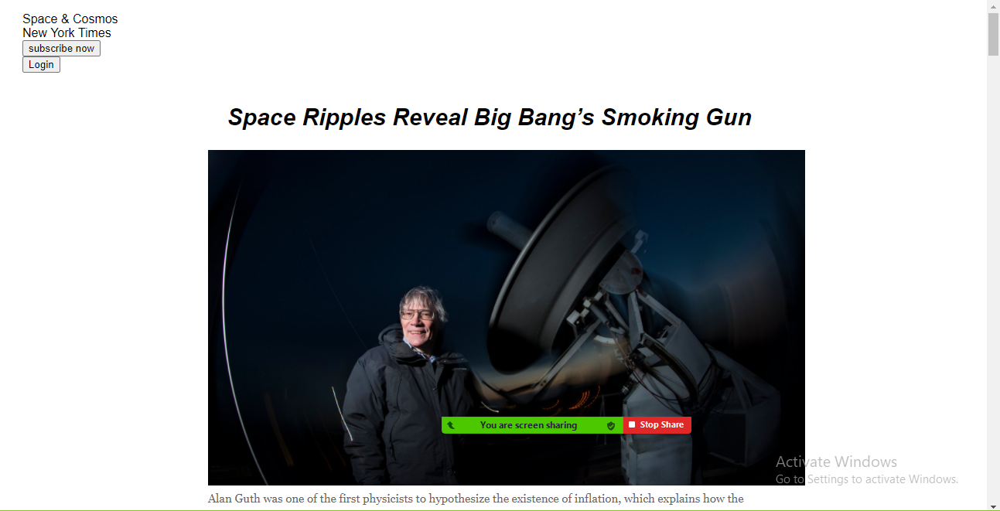

# NEW-YORK-TIMES
This project is about making a clone of the New York Times article page, using the following;
- Embedding images
- The box model
- Flexbox
- Positioning
 

## The following are some the features of this project:

- Has input fields for email, phone number and password
- Has sign-up button
- Has sign-in button
- Has a link taking you to the forgot my user ID and password page
- Has different links for privacy policy, privacy statement and terms of use
- Has a footer with different links for legal, security and privacy.

## Built With

- HTML5
- CSS3

## Getting Started 

For one to get started, just clone the repository and open index.html file in your browser.

## Author

 **Opara Victor Obumneme**

- Github: [victorobumneme](https://github.com/victorobumneme)
- Twitter:[@victorobumneme](https://twitter.com/victorobumneme)
- Linkedin: [Victor Obumneme](https://www.linkedin.com/in/victorobumneme/)

## Contributions

Feature requests and issues are most welcome.

## Live Demo 

[Live Demo](https://rawcdn.githack.com/victorobumneme/NEW-YORK-TIMES/c057992c8dab8da6f067e8ee2d7b9094e707f311/index.html)

## Show your support

Give a ⭐ if you like this project.

## License

This project is [MIT](https://github.com/victorobumneme/NEW-YORK-TIMES/blob/master/LICENSE) licensed.